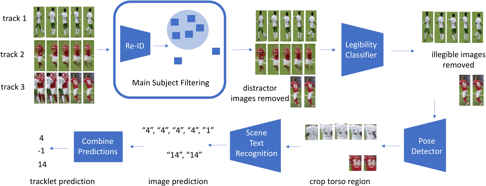

## Player Tracking
			
Detecting and tracking players throughout the game is important for game analysis and automatic stats collection. It supports other sports video understanding tasks such as game event detection.  Current state-of-the-art approaches are focused on MOT (Multi-object tracking) of pedestrians and vehicles. The task of tracking players brings its own challenges: players on the same team have a very similar appearance, fast motion and frequent occlusions complicate the task.  In our research, we are building on top of current MOT state-of-the-art methods while addressing sports-specific challenges.

## Jersey Number Recognition 
			
Jersey number recognition is a key task in sports video analysis, due in part to its importance for long-term player tracking.  Unfortunately, each player's jersey number is only visible in a fraction of video frames.  Jersey number recognition can be viewed as a variant of scene text recognition. We introduce a general framework for jersey number recognition that builds on top of scene text recognition methods. We address issues of occlusions and assess the degree to which training on one sport (hockey) can be generalized to another (soccer). For the latter, we also consider how jersey number recognition at the single-image level can be aggregated across frames to yield tracklet-level jersey number labels. We demonstrate high performance on image- and tracklet-level tasks, achieving 91.4% accuracy for hockey images and 87.4% for soccer tracklets.

Maria Koshkina, James H. Elder <a href='https://arxiv.org/abs/2405.13896'>A General Framework for Jersey Number Recognition in Sports Video</a>(accepted to CVSports Workshop at CVPR 2024).
			 
			Code is available <a href='https://github.com/mkoshkina/jersey-number-pipeline/'>here</a>.

## Unsupervised Player Classification 

We address the problem of unsupervised classification of players in a team sport according to their team affiliation when jersey colours and design are not known a priori. We adopt a contrastive learning approach in which an embedding network learns to maximize the distance between representations of players on different teams relative to players on the same team, in a purely unsupervised fashion, without any labelled data. We evaluate the approach using a new hockey dataset and find that it outperforms prior unsupervised approaches by a substantial margin, particularly for real-time applications when only a small number of frames are available for unsupervised learning before team assignments must be made. Remarkably, we show that our contrastive method achieves 94% accuracy after unsupervised training on only a single frame, with accuracy rising to 97% within 500 frames (17 seconds of game time). We further demonstrate how accurate team classification allows accurate team-conditional heat maps of player positioning to be computed. 
			

			
Maria Koshkina, Hemanth Pidaparthy, James H. Elder <a href='https://openaccess.thecvf.com/content/CVPR2021W/CVSports/papers/Koshkina_Contrastive_Learning_for_Sports_Video_Unsupervised_Player_Classification_CVPRW_2021_paper.pdf'>Contrastive Learning for Sports Video: Unsupervised Player Classification</a>
			(2021), In Proceedings of the IEEE/CVF Conference on Computer Vision and Pattern Recognition (CVPR) Workshops, 4528-4536. 
			For more info see our <a href='https://mkoshkina.github.io/teamId/'>project page</a> and <a href='https://github.com/mkoshkina/teamId/'>code</a>.
			
